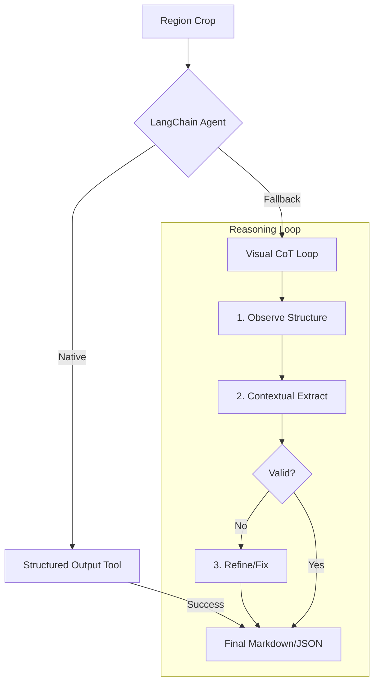

# Document Intelligence Processor

An intelligent document processing pipeline that converts PDFs and images into structured Markdown and JSON. It leverages a **LangChain-powered Agentic Flow** to achieve human-level accuracy in extracting complex tables and figures.

---

## Agentic Architecture

The processor uses a multi-layered extraction strategy managed by a **LangChain Agent**:

1.  **Structured Output (Primary)**: Uses OpenAI's native tool-calling with **Pydantic schemas** to enforce strict data structures (Headers, Rows, Data Points).
2.  **Visual Chain-of-Thought (Fallback)**: If structure extraction is ambiguous, the agent performs a "Think-then-Extract" loop:
    -   **Observe**: The model describes the visual layout in natural language to focus its attention.
    -   **Extract**: The model uses its own description as context to generate valid JSON.
    -   **Refine**: Automatic self-correction if JSON validation fails.



---

## Key Features

-   **LangChain Agentic Flow**: High-reliability extraction using advanced reasoning and self-correction.
-   **Native Pydantic Validation**: Guarantees that extracted tables and charts match your required JSON schema.
-   **Hybrid Text Extraction**: Precision PyMuPDF clipping for text layers, falling back to PaddleOCR for scanned content.
-   **Multi-Provider Support**: Built-in support for **OpenAI** (via LangChain) and **Ollama** (Local models).
-   **Dual Output**: Generates both machine-readable JSON and human-readable Markdown.

---

## Quick Start

### 1. Install dependencies

```bash
pip install -r requirements.txt
```

### 2. Configure OpenAI

Set your `OPENAI_API_KEY` in an `.env` file or environment variable.

### 3. Run via CLI

```bash
# Process a PDF with the LangChain Agent
python run.py document.pdf --output result.md --output-json result.json

# Process an image with a local Ollama model
python run.py image.png --provider ollama --vlm-model llava
```

---

## Data Models (Pydantic)

We enforce strict schemas for visual elements to ensure downstream data reliability:

### `TableSchema`
- `headers`: List of column names.
- `rows`: 2D list of cells (supports strings, numbers, and nulls).
- `notes`: Captions or footnotes found near the table.

### `FigureSchema`
- `figure_type`: Bar chart, Line graph, Flowchart, etc.
- `description`: Detailed textual analysis of the visual content.
- `data_points`: Extracted label-value pairs.
- `trends`: Key insights or observed trends.

---

## Module Reference

| Component | Responsibility |
| :--- | :--- |
| `DocumentAgent` | Orchestrates the LangChain reasoning and extraction logic. |
| `OpenAIProvider` | LangChain-based interface for OpenAI Models. |
| `LayoutDetector` | PaddleOCR PPStructure for region identification. |
| `DocumentProcessor` | Main orchestrator managing the hybrid PDF/OCR/VLM pipeline. |
