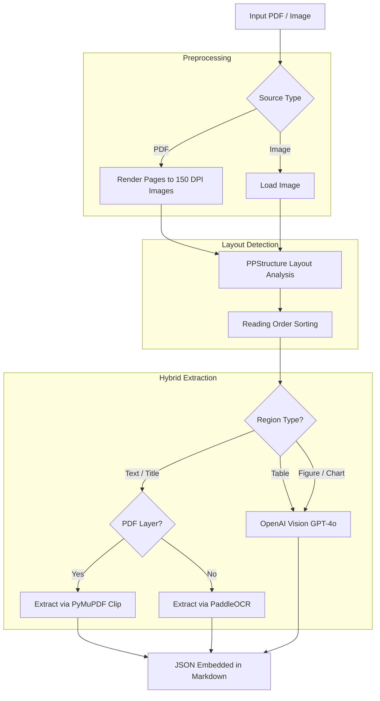

# Document Intelligence Processor

An intelligent document processing pipeline that converts PDFs and images into structured Markdown. It uses a **Hybrid Extraction** approach: leveraging the precision of PDF text layers where available, and the "vision" of Large Language Models (GPT-4o) for complex elements like tables and charts.

---

## Architecture (Hybrid Flow)



---

## Key Features

-   **Hybrid Text Extraction**: Uses PyMuPDF to "snip" text directly from the PDF layer for perfect accuracy, falling back to PaddleOCR for scanned regions.
-   **Visual Table Parsing**: Converts complex table images into structured JSON using OpenAI's GPT-4o Vision.
-   **Figure Analysis**: Automatically describes charts and diagrams, extracting data points and trends.
-   **Reading Order Awareness**: Intelligently sorts detected regions into a logical top-to-bottom, left-to-right reading flow.
-   **Cross-Format Support**: Handles standard PDFs, scanned documents, and 15+ image formats (.png, .jpg, .webp, .heic, etc.).

---

## Quick Start

### 1. Install dependencies

```bash
pip install -r requirements.txt
```

### 2. Set your OpenAI API key
Ensure you have an `.env` file or export your key:

```bash
export OPENAI_API_KEY="sk-..."
```

### 3. Run via CLI

```bash
# Process a PDF and save as Markdown
python run.py document.pdf --output result.md

# Process and save an annotated image showing detected regions
python run.py document.pdf --annotated layout.png --output result.md
```

---

## Python API

```python
from document_processor import DocumentProcessor

# Initialize with desired OCR language and VLM model
processor = DocumentProcessor(ocr_lang="en", vlm_model="gpt-4o")

# Process document
result = processor.process(
    input_path="report.pdf",
    save_annotated="debug_layout.png"
)

# Export to Markdown
markdown_content = result.as_markdown()
print(markdown_content)
```

---

## Data Models

### `PageElement`
Every detected region (text, table, figure) is stored as a `PageElement`:
- `element_type`: "text", "title", "table", "figure"
- `content`: `str` for text; `dict` (JSON) for tables/figures.
- `bbox`: `[x1, y1, x2, y2]` coordinates.
- `confidence`: Detection confidence score.

### `Table` Extraction JSON
```json
{
  "headers": ["Product", "Units", "Revenue"],
  "rows": [["Widget A", "1200", "$48K"], ...],
  "notes": "Figures are unaudited estimates.",
  "region_type": "table"
}
```

---

## Module Reference

| Class / File | Responsibility |
| :--- | :--- |
| `LayoutDetector` | Uses PaddleOCR `PPStructure` to find layout regions. |
| `OCRExtractor` | Fallback OCR engine for scanned text regions. |
| `VLMAnalyzer` | Interfaces with OpenAI Vision for tables and figures. |
| `DocumentProcessor` | Orchestrates the hybrid flow and coordinate mapping. |
| `run.py` | CLI entry point for processing and saving results. |
